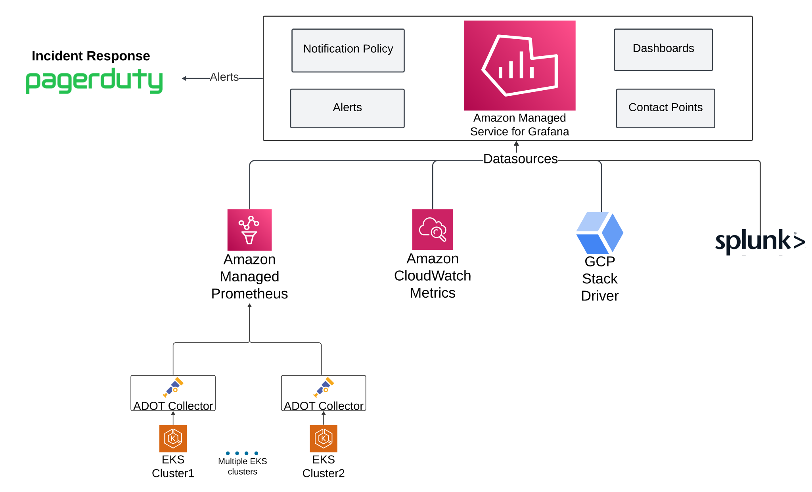
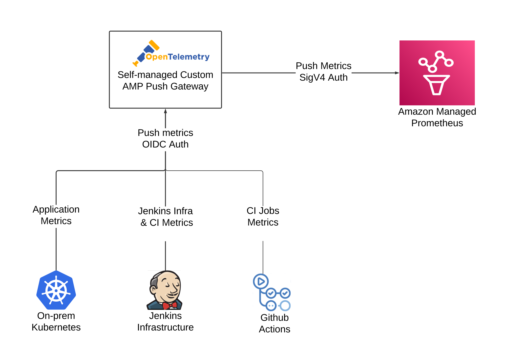

# aws-amp-otel-observability-blog

Amazon Managed Prometheus Opentelemetry Observability Blog

## Pre-requisites
- Install [AWS Cli](https://docs.aws.amazon.com/cli/latest/userguide/getting-started-install.html)
- Install [eksctl](https://eksctl.io/installation/)
- Install [helm](https://helm.sh/docs/intro/install/)

1. Create EKS Cluster

```
eksctl create cluster -f cluster.yaml
```

2. Access EKS cluster

```
aws eks update-kubeconfig --name amp-test-cluster  --region us-east-2 --alias amp-test-cluster --prof
ile <AWS PROFILE>
```

3. Verfiy Kubernetes Access

```
kubectl get pods -A
```

Sample Output:

```
NAMESPACE     NAME                       READY   STATUS    RESTARTS   AGE
kube-system   aws-node-knlpf             2/2     Running   0          60m
kube-system   aws-node-xg88z             2/2     Running   0          60m
kube-system   coredns-858457f4f6-7nvmr   1/1     Running   0          63m
kube-system   coredns-858457f4f6-l9kxk   1/1     Running   0          63m
kube-system   kube-proxy-5hwmf           1/1     Running   0          60m
kube-system   kube-proxy-987h9           1/1     Running   0          60m
```

## Collect Metrics using ADOT Collector and push them to AMP



### Create an Amazon Managed Prometheus (AMP) Instance

```
aws amp create-workspace --alias amp-testing --region us-east-2
```

Sample Output:
```
{
    "workspaceId": "ws-xxxx-751d-476a-9bcc-xxxx",
    "arn": "arn:aws:aps:us-east-2:xxxxx:workspace/ws-xxxx-751d-476a-9bcc-xxxx",
    "status": {
        "statusCode": "CREATING"
    },
    "tags": {}
}
```

### Install Sample Web App to scrape Prometheus Metrics

Reference: https://github.com/aws-observability/aws-otel-community/tree/master/sample-apps/prometheus-sample-app


## Send Metrics from non-EKS systems like CI (Jenkins/GitHub Actions) to custom OTel Gateway and push them to AMP



### [Create AWS Cognito OIDC User Pool](generic-otel-pushgateway/1-create-aws-cognito-oidc-user-pool/README.md)

### Install Custom OTel Gateway HTTP Endpoint on EKS

```
cd 2-custom-otel-gateway-on-eks
```

```
helm install custom-otel-gateway --namespace custom-otel-gateway .
```

### Test with Python Client

```
cd 3-otel-python-client
```

```
export SERVICE_NAME="custom_onprem_otel_metric"
export USER_POOL_DOMAIN="xxx" # Your Cognito Domain from step 1
export CLIENT_ID="xxx" # Your Cognito Pool Client ID from step 1
export CLIENT_SECRET="xxx" # Your Cognito Pool Client Secret from step 1
```

```
python otel-python-client.py --service_name "jenkins-ci-metrics" --instrument_name "job-ci-success" --instrument_kind "counter" --measurement_value "1.0" --instrument_description "Jenkins Job CI Success Metrics"
```